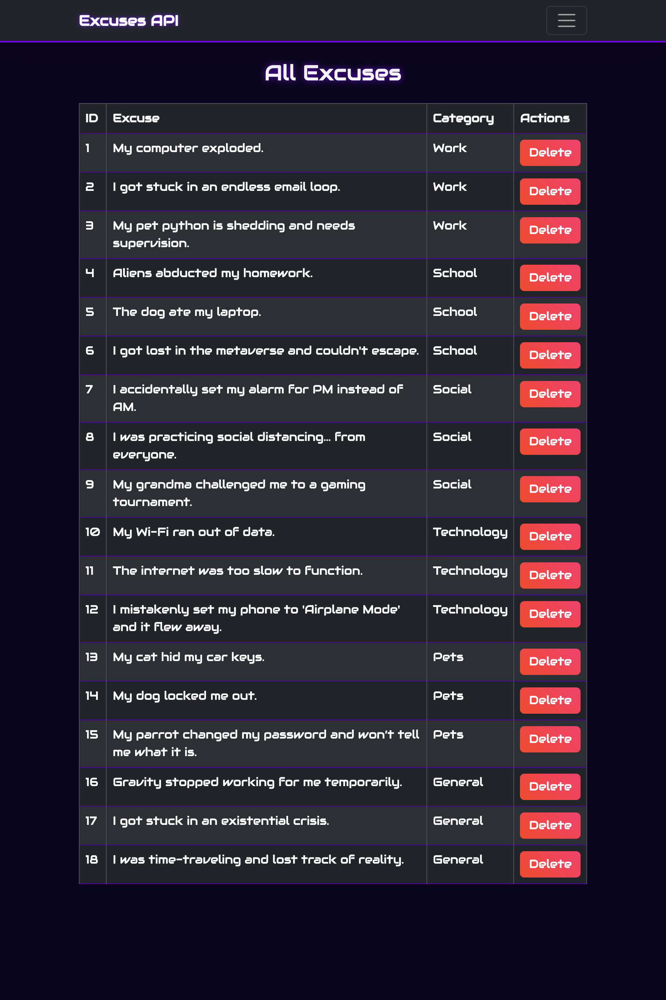
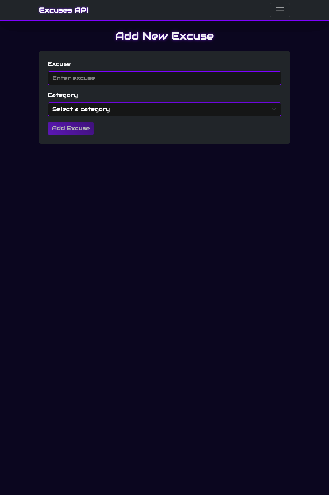

# Project Excuses - Frontend with React

## Setup

Create a `.env` file in the root directory and configure:

```text
VITE_API_BASE_URL=...
```

## Tech Stack

- React + TypeScript
- react-bootstrap (styling & UI components)
- react-router (navigation)
- @reduxjs/toolkit & react-redux (state management)
- RKT Query, createApi + fetchBaseQuery (data fetching)


## Images

### All Excuses Page



### Add Excuse Page


